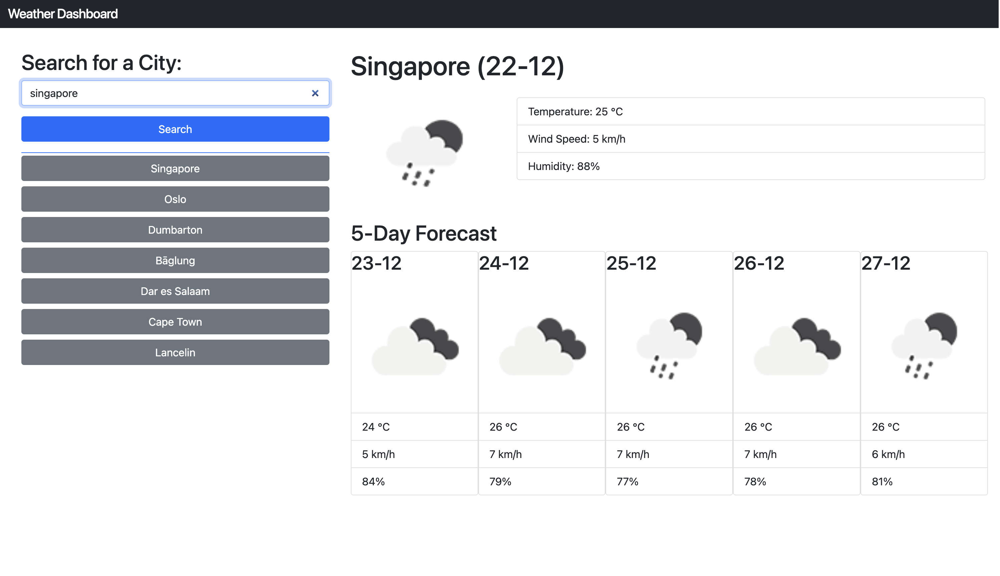

# Weather Dashboard 
 

App deployed to: https://ryanmcd29.github.io/Weather-App/

## Description
Weather dashboard that allows user to quickly search for a requested city. When a city has been requested the cities name is placed on a list and saved in local storage. Up to 7 recently searched for cities are placed in the list and are call the conditions in that city upon when clicked on.

## Usage
This application is deployed to a URL and can be accessed using an internet browser. 

## Credits

## License
Please refer to the LICENSE in the repo
